# Ontological Control Systems (OCS): Towards an Intrinsic AI Safety Layer

[](https://colab.research.google.com/drive/1dm_b49hK1zC3Bo1ivCgdIc0i2rLKiUre)
[](https://opensource.org/licenses/MIT)
[](https://www.python.org/downloads/)

**A framework for AI safety based on minimizing multi-dimensional ontological tension (τ), moving beyond external filters to an intrysic motivation or arquitecture per se."**

This repository contains the prototype implementation and experiments for the **Ontological Control Systems (OCS)** paradigm. Our goal is to build AI systems that are intrinsically driven to minimize internal tension across epistemic, social, and physical dimensions—rather than solely maximizing external reward—forming a stable foundation for alignment.

> **Foundational Formalism:** The complete theoretical framework and mathematical formalization is detailed in a separate repository: **[Ontological Control Systems - Formalism](https://github.com/caiodasilva1/ontological-control-systems-formalism)**

## 🚀 Quick Start: Run in < 5 Minutes

The fastest way to evaluate the core τ-Veto mechanism is via our zero-setup Colab notebook, which includes a live demo:

**[Open the Main Demo in Google Colab](https://colab.research.google.com/drive/1dm_b49hK1zC3Bo1ivCgdIc0i2rLKiUre)**

For local installation and development:
```bash
# 1. Clone the repository and navigate into it
git clone https://github.com/caiodasilva1/ocs-system-framework.py.git
cd ocs-system-framework.py

# 2. (Optional but recommended) Create and activate a virtual environment
python -m venv venv
source venv/bin/activate  # On Windows use: venv\Scripts\activate

# 3. Install the required dependencies
pip install -r requirements.txt

# 4. Run the main interactive demo
python demo/tau_veto_demo.py
```

🧠 Core Idea: From Cages to Conscience

Current AI alignment often relies on external "cages"—filters and reward models wrapped around a core optimizer that remains amoral. This makes systems brittle and vulnerable to jailbreaks.

Ontological Control Systems (OCS) propose a different paradigm: embedding an intrinsic drive for coherence within the agent itself. The agent's primary objective becomes the minimization of its own ontological tension (τ), a vector quantifying:

· Epistemic Tension: Internal inconsistency, uncertainty, or contradiction in knowledge.
· Social Tension: Misalignment with norms, violation of values, or causing harm.
· Physical Tension: Impending system stress or violation of operational constraints.

🔄 How It Works: The τ-Veto Process

The τ-Veto head integrates directly into the token-generation loop, acting as an intrinsic monitor. It computes a multi-dimensional tension vector in real-time to intercept harmful trajectories.

```mermaid
flowchart TD
    A[User Prompt] --> B[Base LLM]
    B --> C[Generate Next Token]
    C --> D{τ-Veto Head<br>Compute τ}
    D --> E[Epistemic τ?]
    D --> F[Social τ?]
    D --> G[Physical τ?]
    E & F & G --> H{Aggregate τ > Threshold?}
    H -->|No| I[Token Accepted]
    I --> C
    H -->|Yes| J[Veto Triggered]
    J --> K[Block Sequence]
    K --> L[Output Safe Response]
```



Key Performance Metrics (A100, 7B Model, batch=1):

· Latency Overhead: +11 ms per token
· Memory Overhead: +6% (~370 MB)

📊 Evidence & Benchmarks

Early prototype results demonstrate the feasibility of τ-based control. The τ-Veto was evaluated on a curated set of adversarial prompts (from custom injections) and benign prompts.

Preliminary Results (GPT-2 Scale):

· Adversarial Block Rate: 92%
· Benign False Positive Rate: 3%
· Latency Increase: +11 ms/token (see architecture section)

Note: A core goal of the requested grant is to scale and rigorously validate these results on 7B-parameter models using standardized benchmarks like AdvBench.

📁 Repository Structure

Core Framework & Safety

· tau_framework.py - The central library defining the TensionVector and logic for calculating τ.
· tau_veto.py - The main TauVetoHead safety-layer class to wrap Hugging Face models.

Environments & Experiments

· environments/moral_maze.py - A custom multi-agent grid-world to benchmark social tension and cooperation.
· environments/flatlander.py - An environment for testing structured exploration.
· experiments/ - Scripts for running comparative benchmarks.

Demos & Getting Started

· demo/tau_veto_demo.py - The main local demo script.
· requirements.txt - Python dependencies.

🗺️ Project Roadmap & Grant Alignment

This repository is the foundation for a 6-month research grant aimed at scaling and validating OCS for frontier-model safety.

Phase 0 (Completed)

· ✅ 1.3B-scale τ-Veto prototype
· ✅ Public repository & MIT licence
· ✅ Initial quantitative benchmarks

Phase 1 (Grant: Months 1-3) - Scale to 7B

· 🔄 Port and optimize τ-Veto for Mistral-7B.
· 🔄 Rigorous evaluation on AdvBench subset and social dilemma tasks.
· This phase is blocked on compute grant funding.

Phase 2 (Grant: Months 4-6) - Productize & Disseminate

· 🛠️ Refactor core components into a pip-installable ocs-safety library.
· 🛠️ Publish a detailed technical report / arXiv preprint.

Phase 3 (Ongoing) - Collaborate

· 🤝 Seek pilot evaluations with alignment teams at frontier AI labs.
· 🤝 Pursue academic collaboration for a full conference paper.

🤝 Contributing & Citation

We welcome scrutiny and collaboration from the safety community. If you find a security issue or jailbreak, please open a private issue first; we follow a 90-day disclosure policy.

Academic Citation:
If this work contributes to your research,please cite the formalism and this implementation:

```bibtex
@misc{pereira2025ocsformalism,
  title={Ontological Control Systems: A Formalism for Intrinsic AI Safety},
  author={Pereira, Caio},
  year={2025},
  url={https://github.com/caiodasilva1/ontological-control-systems-formalism}
}
@misc{pereira2025tauveto,
  title={τ-Veto: An Intrinsic Safety Head via Ontological Tension Minimisation},
  author={Pereira, Caio},
  year={2025},
  url={https://github.com/caiodasilva1/ocs-system-framework.py}
}
```

📜 License

This project is licensed under the MIT License - see the LICENSE file for details.

---

Research by Caio Pereira. This project is part of a proposal to the Long-Term Future Fund, focused on reducing existential risk from misaligned AI.

